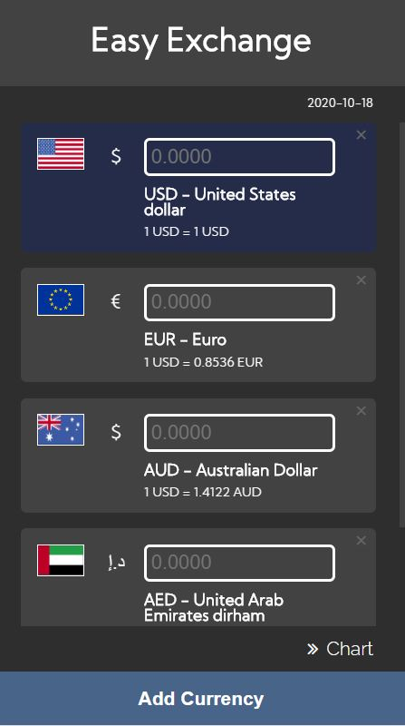
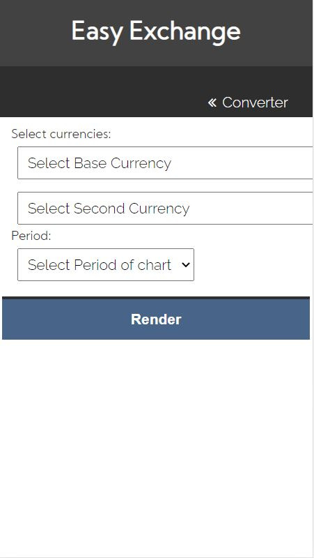

# HIT238
App name: Easy Exchange

https://hngan2907.github.io/HIT238/

This is a currency exchange rate converter mobile application integrated with currency chart.

Just enter the amount of money you want to convert at any position, there will be multiple converted.
To motify your currency list, click 'Add Currency' button to add one or more currencies.

To use currency chart function, click on 'Chart' located at the right bottom corner.

For this function, you need to enter all information.
Base currency has a value of 1
The second currency, which is the main currency, will be the line of the chart, represents the increase or decrease of the main currency compares to the base currency
Period: timeline of the chart
Then click 'Render' button to see the chart.
Data retrieval is based on the Internet, so if your home network is slow, you should be a bit patient to wait for the chart to appear/update.
